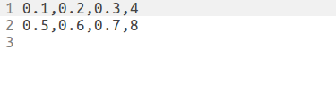

<!-- 
  TODO:
  Add in section links
  Add step to calibrate workspace to setup
  Move Videos to youtube
  Add image flipping code and take new calibration video
  Interpreting Mill Controller Output section
  Add new output that's more useful
-->

# Introduction
This is the code of a ROS package designed to provide computer vision based feedback control for an X-Carve CNC mill configured to operate as a pen plotter with time controlled x, y, and z input. The package has several methods of accepting (x,y,z,time) trajectories, which it then parses into GCode and sends to the X-Controller to be executed.  
If the user has set a time horizon, the mill will operate until the appropriate timestamp in the trajectory is reached, then stop operating and move the equipment away from the material. Images of the material are taken by a fixed usb camera and then processed to identify locations where the mill has drawn on the paper. This data is visualized in Rviz, and published to ROS topics in a variety of formats.  
The published data can be used to determine how well the mill has performed in executing the trajectory so far, and what alterations to the planned trajectory are necessary to achieve the desired end result of the trajectory planner.  
The motivation underlying the construction of this project is to support the ergodic trajectory research of Ahalya Prabhakar and the Neuroscience and Robotics Laboratory at Northwestern University.  

## Build Instructions
    This package was developed on Linux Ubuntu 16.04 (Xenial Xerus), with ROS Kinetic Kame. Comptibility with earlier or later versions of this software is not guaranteed.

1. Install ROS on your system following the instructions listed here: http://wiki.ros.org/ROS/Installation.

2. Create a catkin workspace using the methods described here: http://wiki.ros.org/ROS/Tutorials/InstallingandConfiguringROSEnvironment. This directory will be referred to as "catkin_ws" during the rest of these instructions.

3. Install dependencies: Ensure that you have the following dependencies. Note that this list may be incomplete, but should cover most requirements not included in the standard ROS installation:
  1. ros-kinetic-octomap-mapping
  2. ros-kinetic-octomap-rviz-plugins
  3. ros-kinetic-image-view

4. Open a terminal and move to your catkin workspace's src directory by entering, for example: `cd ~/catkin_ws/src` if your workspace is in the home directory.

5. Clone this package using `git clone` with a link from the "clone or download" button on the top right of this page.

6. Enter `cd ..` to move back to the workspace root.

7. Enter `catkin_make` to build the packages in the workspace.

If all dependencies are installed correctly, the package should now be ready to run.

## Run Instructions
### Calibrating the Camera
The camera_calibration package contains tools to identify and compensate for any imperfections in your camera lens, and is fully compatible with most ROS camera drivers. Find detailed information on the package [here], and a tutorial on using it [here]. Be sure to set the image topic and camera name correctly.:

1. Open a terminal and enter `roscore` to start a new ros master process.

2. Open a terminal and enter `rosrun usb_cam usb_cam_node _video_device:=/dev/video1 _pixel_format:=yuyv _camera_name:=mill_camera`.

3. Open a terminal and enter `rosrun camera_calibration cameracalibrator.py --size 8x6 --square .0245 image:=/usb_cam/image_raw camera:=/usb_cam`. The checkboard size argument is based on the number of inner corners (the number of squares-1), while the size is a measurement in meters.

### Calibrating The Workspace and Material
Assumptions in instructions:
1. Your catkin workspace is in the user's home folder and is named "catkin_ws"
2. You are using a USB camera compatible with the package camera driver.

It will be necessary to perform a NORMAL calibration of the camera each time you want to change the size or location of your material.  
If the position of the camera itself is adjusted, or the camera is detached and re-attached, then a FULL calibration will be necessary.  
If images of the material appear to be warped or misaligned, then try recalibrating the camera by following these steps.  
You can see a video of the calibration interface being used in the [Calibrating the Workspace] section.

1. Use the instructions in the [Operating the X-Carve Directly] section to move the mill carriage to the edge of the workspace, so that the camera has an unobstructed field of view. You can use the commands `G90 G21` and `G0 X250 Y500` once you are connected to the X-Controller command interface.

2. Have the camera plugged into the USB port. The camera driver used by the package is compatible with most USB cameras. 

3. Identify the port name assigned to your camera. See the [How to Identify Assigned USB and video Ports] section for more instructions on this. 

4. In your terminal, move into your catkin workspace by entering, for example, `cd ~/catkin_ws`.

5. Source your development "setup.\*sh" file, for example by entering `source devel/setup.bash` if you are using a bash terminal.

6. Enter `roslaunch mill_controller image_calibration.launch`. If your video port is not /dev/video1, add the argument ` video_device:=/dev/video#`, replacing # with the number of your video port name. The launch file will begin a NORMAL calibration by default. If you wish to perform a FULL calibration, add the argument `calibration:=FULL`

7. You should be presented with two windows: an image of the X-Carve workspace, and a window with instructions. If the mill carriage is blocking the image, refer to step 1.

8. The image alignment script will guide you through calibrating the location of the X-Carve cutting board and the material you intend to be working with in the image taken from your webcam. This information will be used in image processing so that output information will consist of just the working material rather than the whole image.

### Preparing a Trajectory Using .csv File Input.
Assumptions in instructions:
    1. Your catkin workspace is in the user's home folder and is named "catkin_ws"
There are a number of possible input methods for the mill controller, but the most straightforward and flexible one is to use csv files to store your trajectory input. 
You will need to store csv files in the trajectories/ directory of the installed mill_controller package in your catkin workspace's src/ directory. To navigate a terminal here, for example, you might enter `cd ~/catkin_ws/src/mill_controller/trajectories/`.
These instructions will walk you through examining an example csv file, creating a simple csv file of your own, and having it read as trajectory input.

1. Navigate to the directory containing your package, inside of your catkin workspace. From there, open the trajectories/ directory. In addition to the commands above, you could also bring a terminal to this directory by entering `roscd mill_controller/trajectories/`.

2. In this directory there should already be a pair of csv files, "example.csv" and "fake.csv". To find out about fake.csv, refer to the notes on the black_box node in the [Launch Files, Nodes, and Arguments] section. Open example.csv in your preferred text editor.

3. The file should contain some simple formatted text.  

   This is the correct format for trajectory input. Each line represents a distinct x,y,z point along the trajectory at a given time t.  
   The values can be written as integers or decimal numbers. Values for x,y, and z must be within the set input range, which is from 0 to 1 by default. The value for t should be in seconds. The format is "x,y,z,t".  
   The material origin is considered to be in bottom left corner of the material, with positive x toward the material's bottom right corner and positive y toward the material's top left corner.  
   The appropriate input ranges of x, y, and z can be set when you start the mill controller. See the [Launch Files, Nodes, and Arguments] section for a more complete explanation of input range. By default the input ranges are from 0.0 to 1.0, representing percentage of the material's dimension along that axis.  
   This example file contains a 2 point trajectory, from (x=10%, y=20%, z=30%) at t=4.0 seconds to (x=50%, y=60%, z=70%) at t=8.0 seconds.  
   The first point on a trajectory does not need to be at 0 seconds, but the mill controller will always count up from 0 when applying a time horizon.  

4. To create your own csv file, open an empty file and add lines to it following the format demonstrated in the last step. Once you are finished adding lines, save your file in the "trajectories/" directory as "your_file.csv"

5. Refer to the [Running a Trajectory] section to have the mill controller run your trajectory on the X-Carve.

### Running a Trajectory
Assumptions in instructions:
1. Your catkin workspace is in the user's home folder and is named "catkin_ws"
2. Your trajectory is in a csv file named "your_file.csv"

These instructions will guide you through running a trajectory of your own.

1. Open a terminal and move into your catkin workspace, for example by entering `cd ~/catkin_ws/`

2. Source your development setup.\*sh file, for example by entering `source devel/setup.bash` if you are using a bash terminal.

3. Have a trajectory csv file as described in the [Preparing a Trajectory Using csv Input] section. This should be in the mill_controller/trajectories/ directory.

4. Connect your X-Carve and USB camera to your computer. Turn the X-Carve on using the switch at the back of the X-Controller.

4. Calibrate your workspace and the location of the material for imaging by following the instructions in the [Calibrating The Workspace and Material] section. If none of your calibration data has changed since the last time you calibrated, then you may skip this step and the most recent data will be used.

5. Launch the mill controller by entering `roslaunch mill_controller mill_controller.launch`.  
By default, the mill controller will expect you to be placing an 11"x8.5" piece of paper in the lower left corner of the workspace, with the long side parallel to the workspace's bottom edge. You can customize the dimensions, location, and rotation of the material by adding input arguments to the command. These arguments are explained in detail in the [Launch Files, Nodes, and Arguments] section.<!-- todo: move --> For example: to change the position of the material's origin to 200mm on the x axis and 150mm on the y axis in the machine workspace, we would instead enter the command:  
`roslaunch mill_controller mill_controller.launch x_offset:=200 y_offset:=150`

   You should also change the usb port and video port if necessary using the appropriate arguments. Determining what video port your camera is on is described in the [Calibrating the Workspace and Material] section. You can identify the usb port your X-Carve has been assigned by using the same method with the command `ls /dev/ttyUSB*`.

6. Now that your material is in place, the workspace is calibrated, your trajectory is ready, and you have launched the mill controller with arguments to inform it of the material position and dimensions, it is time to run your trajectory. Since we did not launch the mill controller with a file name to run automatically (see [Launch Files, Nodes, and Arguments] for more on this option) we will need to publish a string message containing the name of our trajectory csv file. Open a new console and enter the following command, replacing the name of the trajectory file if necessary:  
`rostopic pub /csv_name_topic std_msgs/String "data: 'my_trajectory.csv'"`

7. The mill controller will now read my_trajectory.csv from the trajectories/ directory, translate it into a gcode file named "output.gcode", and stream those gcode commands to the X-Carve. Since we did not place the X-Carve in closed loop mode, it will run the entire trajectory before taking an image of the completed drawing and publishing its output.

8. The X-Carve should provide several visual representations of output along with an Occupancy message that encodes an array representing locations on the material that have and have not been worked. Understanding this output is covered in the [Interpreting Mill Controller Output] section.

### Interpreting Mill Controller Output
Output representing the state of the working material is provided by mill_controller.launch in a number of formats.  

* The "/camera_depth_points" topic publishes PointCloud2 messages representing every white pixel in the processed image. This represents the full data before it is translated into an octomap at a lower resolution.  
* The "/occupied_cells_vis_array" topic publishes MarkerArray messages representing the octomap created from the data on "/camera_depth_points". Regions of the image that contain white pixels are considered occupied cells in the octomap and are represented with a green cube in the MarkerArray messages.
* The "/free_cells_vis_array" topic publishes MarkerArray messages representing octomap cells known to be unoccupied with a green cube. Because of how the octomap is generated, however, not all cells in the array are known. This greatly reduces the usefulness of the topic.
* The "/octomap_to_cloud" topic publishes Marker messages representing the centers of occupied cells in the material octomap. This should correspond to the "/octomap_point_cloud_centers" messages published by the /octomap_server node, and is mostly for validation.  
* The "/octomap_to_occupancy" topic publishes Occupancy messages as defined in the mill_controller package. These contain the dimensions of an array representing the contents of the octomap, along with the index values of all unoccupied cells in that array. Combining this information allows the array to be reconstructed.

### An Example Run in Video
##### Calibrating the Workspace

##### Operating the Mill

## Reference Instructions and Information
### Operating the X-Carve Directly
The X-Carve uses a customised [Grbl] controller. The specifics of Grbl are beyond the scope of this readme, but the controller accepts most standard gcode commands. These instructions will allow you to operate the X-Carve directly using the program [Screen].

1. Plug the X-Carve USB cord into your computers USB port and turn the X-Carve on.

2. Determine what usb port the X-Carve has been assigned. You can reference the [How to Identify Assigned USB and video Ports] section for more detailed instructions. 

3. Open a terminal and enter the command `screen /dev/ttyUSB0 115200`, replacing "/dev/ttyUSB0" with the correct usb port name if necessary.

4. Since this is the first connection the X-Carve has received since being turned on, you should receive a short greeting text with some instructions.

5. You will need to home the X-Carve before it is ready to use. Type `$H` and press `Enter`. You will not see the text you type, but the X-Carve should begin seeking its home position.

6. Once the X-Carve has homed, an `ok` will appear in your terminal. The X-Carve is now ready to receive further commands. A full list of supported commands can be found [at https://github.com/gnea/grbl/wiki/Grbl-v1.1-Commands], and definitions of the Gcode commands can be found [at https://www.cnccookbook.com/g-code-m-code-reference-list-cnc-mills/].

### Resetting the Workspace Origin
The origin of the X-Carve standard workspace has been designated as being in the bottom left of the 500mm by 500mm silkscreen grid drawn on the X-Carve base board, from the perspective of a person standing in front of the X-Carve and looking directly at it. The official designation of this workspace is G54. Should the origin need to be reset at some point, follow these instructions.

1. Follow the instructions in the [Operating the X-Carve Directly] section to connect to the X-Carve and begin homing it.

2. Once the X-Carve is homed, enter the command `G91 G21` to place the controller in Incremental mode, interpreting commands in millimeters.

3. Enter the command `G0 X17 Y5 Z-20` to move the mill carriage to the appropriate 0,0,0 position. 

5. Enter the command `G10 L20 P1 X0 Y0 Z0` to set the G54 workspace origin to the current position.

6. Enter the command `G90 G21` to return the controller to Absolute mode, interpreting commands in millimeters.

### How to Identify Assigned USB and video Ports
These instructions will guide you through the commands used to identify the ports your computer assigns to devices you plug in. On Linux, usb ports will be of the form `/dev/ttyUSB0`, while video ports are of the form `/dev/video0`. The number in the port name will vary depending on the order in which things are plugged in. Some devices attached to your ports may be built into your computer. For example a built in web camera is usually assigned `/dev/video0`. By default, the package will assume that your camera is on `/dev/video1`, and that the X-Carve is attached to `/dev/ttyUSB0`. If that is not the case then you will need to identify the ports these devices are attached to and either include the correct ports as arguments at launch time, or alter the launch files so that they are the default.  

To identify the port of your usb camera:
1. Disconnect the camera.

2. Open a terminal and enter `ls /dev/video*`. Take note of the ports listed, if any.

3. Reconnect the camera.

3. In the terminal, enter `ls /dev/video*` again.

4. Compare the two lists. The name that appeared when you reconnected your camera is the camera's port name. If it isn't `/dev/video1`, then you should substitute your port name whenever the camera port is used in these instructions.

To identify the port of the X-Carve
1. Disconnect the X-Carve.

2. Open a terminal and enter `ls /dev/ttyUSB*`. Take note of the ports listed, if any.

3. Reconnect the X-Carve.

3. In the terminal, enter `ls /dev/ttyUSB*` again.

4. Compare the two lists. The name that appeared when you reconnected the X-Carve is the X-Carve's port name. If it isn't `/dev/ttyUSB0`, then you should substitute your port name whenever the USB port is used in these instructions.

### Connecting the Marker Holder
These are visual instructions for attaching the marker holder to the side of the X-Carve and loading a marker into it.

1. Collect the upper and lower portions of the marker holder, a fine point sharpie marker, a spring, and three M4 screws of at least 6mm length, along with an appropriate screwdriver.

2. Facing the X-Carve from the front, the 3 screw holes are on the left side of the mill carriage.

3. Attach the lower marker holder to the lower two screw holes on the mill carriage.

4. Attach the upper marker holder to the upper screw hole on the mill carriage. Leave the screw loose enough that the holder can slide freely along its screw slot.

5. Place the spring into the upper marker holder. 

6. Remove the cap from the sharpie marker and place the tip into the lower marker holder.

7. Rotate the upper marker holder to rest against the lower marker holder. Allow the upper marker holder to drop onto the marker freely until the force of the spring holds it up. Hold the upper marker holder gently against the side of the lower marker holder so that the sharpie is held vertically. Tighten the screw on the upper marker holder to secure it in place.

8. Check that the marker can be moved up and down by a few millimeters with gentle force. The marker holder is correctly assembled and ready to use.

### Launch Files, Nodes, and Arguments
The package includes a handful of launch files that cover most intended use cases, preventing the user from having to launch nodes directly through rosrun or script execution.  
The user may use ROS's remapping syntax, "variable:=value", at the time of launch to alter the settings being used by the system. If they are not changed, these settings have default values consistent with a pen plotter using a black ink marker and white paper. These default values can also be changed by editing the launch files themselves.

##### Launch Files
  * image_calibration.launch: Launches the nodes needed to calibrate the image alignments used during image processing. A full calibration should be run whenever the camera is moved relative to the workspace. A normal calibration should be run whenever the location or dimensions of the material being worked with by the mill changes.  
  Valid Arguments: 
    * calibration: 
      * Type: String
      * Default: NORMAL
      * Can be set to "FULL" to run a calibration of the workspace location and material position, "NORMAL" to run a calibration of the material position only, or "NONE to skip calibration.
    * m_width: 
      * Type: Double
      * Default: 279.4
      * Represents the length of the material along its own x axis in mm.
    * m_height: 
      * Type: Double
      * Default: 215.9
      * Represents the length of the material along its own y axis in mm.
    * m_angle: 
      * Type: Double
      * Default: 0.0
      * Represents the angle of rotation from the workspace x axis to the material x axis in degrees.
    * x_offset: 
      * Type: Double
      * Default: 0.0
      * Represents the offset from the workspace origin to the material origin along the workspace x axis in millimeters.
    * y_offset: 
      * Type: Double
      * Default: 0.0
      * Represents the offset from the workspace origin to the material origin along the workspace y axis in millimeters.
    * x_range: 
      * Type: List of doubles
      * Default: [0.0,1.0]
      * Represents the acceptable input range for the material x axis. The ends of this range will correlate to the edges of the material on the material's x axis, while values within the range will be scaled appropriately to the size of the material. See the [Preparing a Trajectory Using .csv File Input.] section for more information.
    * y_range: 
      * Type: List of doubles
      * Default: [0.0,1.0]
      * Represents the acceptable input range for the material y axis. The ends of this range will correlate to the edges of the material on the material's y axis, while values within the range will be scaled appropriately to the size of the material. See the [Preparing a Trajectory Using .csv File Input.] section for more information.
    * horizon_time: 
      * Type: Double
      * Default: 0.0
      * Represents the number of seconds of a trajectory to execute before stopping, performing image processing, and outputting data. If set to "0.0", the controller will operate in open loop mode, executing the full trajectory before performing any image processing.
    * csv_name: 
      * Type: String
      * Default: null
      * If this argument is not null, then the controller will immediately look for a file name matching the provided string in the trajectories/ directory of the package and attempt to execute it once the launch is complete. This allows you to have the controller begin following a trajectory immediately when launched.
    * usb_port:
      * Type: String
      * Default: /dev/ttyUSB0
      * The name of the usb port assigned to the X-Carve.
    * video_device: 
      * Type: String
      * Default: /dev/video1
      * The name of the video port assigned to the usb camera.
    * pixel_format: 
      * Type: String
      * Default: yuyv
      * The pixel format to be used when collecting images from the camera.
    * camera_name: 
      * Type: String
      * Default: mill_camera
      * The name to be assigned to the usb camera. This is mostly used for retrieving the correct calibration file.

  * mill_controller.launch: Launches the nodes needed to execute trajectories on the X-Carve.  
  Valid Arguments:
    * m_width: 
      * Type: Double
      * Default: 279.4
      * Represents the length of the material along its own x axis in mm.
    * m_height: 
      * Type: Double
      * Default: 215.9
      * Represents the length of the material along its own y axis in mm.
    * m_angle: 
      * Type: Double
      * Default: 0.0
      * Represents the angle of rotation from the workspace x axis to the material x axis in degrees.
    * x_offset: 
      * Type: Double
      * Default: 0.0
      * Represents the offset from the workspace origin to the material origin along the workspace x axis in millimeters.
    * y_offset: 
      * Type: Double
      * Default: 0.0
      * Represents the offset from the workspace origin to the material origin along the workspace y axis in millimeters.
    * x_range: 
      * Type: List of doubles
      * Default: [0.0,1.0]
      * Represents the acceptable input range for the material x axis. The ends of this range will correlate to the edges of the material on the material's x axis, while values within the range will be scaled appropriately to the size of the material. See the [Preparing a Trajectory Using .csv File Input.] section for more information.
    * y_range: 
      * Type: List of doubles
      * Default: [0.0,1.0]
      * Represents the acceptable input range for the material y axis. The ends of this range will correlate to the edges of the material on the material's y axis, while values within the range will be scaled appropriately to the size of the material. See the [Preparing a Trajectory Using .csv File Input.] section for more information.
    * horizon_time: 
      * Type: Double
      * Default: 0.0
      * Represents the number of seconds of a trajectory to execute before stopping, performing image processing, and outputting data. If set to "0.0", the controller will operate in open loop mode, executing the full trajectory before performing any image processing.
    * csv_name: 
      * Type: String
      * Default: null
      * If this argument is not null, then the controller will look for a file name matching the string in the trajectories/ directory of the package and attempt to execute it once the node launches. This allows you to have the controller begin following a trajectory immediately when launched.
    * usb_port:
      * Type: String
      * Default: /dev/ttyUSB0
      * The name of the usb port assigned to the X-Carve.
    * video_device: 
      * Type: String
      * Default: /dev/video1
      * The name of the video port assigned to the usb camera.
    * pixel_format: 
      * Type: String
      * Default: yuyv
      * The pixel format to be used when collecting images from the camera.
    * camera_name: 
      * Type: String
      * Default: mill_camera
      * The name to be assigned to the usb camera. This is mostly used for retrieving the correct calibration file.

  * octomap_mapping.launch: Launches an octomap server node. This file is intended only for inclusion in other launch files, although at the moment altering the resolution of the octomap must be done here by editing the private parameter "resolution".

##### Nodes
  * black_box: This node can be used to simulate a feedback control loop. To use the node you should first calibrate and launch the mill controller, then open a new console and enter `rosrun mill_controller black_box`. When launched, the node reads a trajectory out of a file named "fake.csv" in the mill_controller/trajectories/ directory. The node produces an output file named trajectorybb.csv, then publishes that file name to be executed by the mill controller. Each time the mill controller publishes feedback information the node reads fake.csv again, adjusts the trajectory's time stamps based on the horizon_time parameter, and removes the part of the trajectory already completed. trajectorybb.csv is then updated and its name is again published for execution. This cycle continues until the original trajectory has been completed. If horizon_time is set to 0.0, black_box will have the trajectory in fake.csv run a single time.  
  Relevant Parameters:
    * horizon_time: 
      * Type: Double
      * Default: 0.0
      * The trajectory will be run using this value to determine how many seconds are executed at a time.
  * csv_parser: This node subscribes to the String topic csv_name_topic. Messages are parsed as the name of a .csv file in the mill_controller/trajectories/ directory. The node will attempt to open that file, parse the contents into a Trajectory message, and publish that message to the topic trajectory_input to be executed.  
  Relevant Parameters:
    * csv_name:
      * Type: String
      * Default: null
      * If this argument is not null, then the controller will look for a file name matching the string in the trajectories/ directory of the package and attempt to execute it once the node launches. This allows you to have the controller begin following a trajectory immediately when launched.
  * gcode_sender: This node subscribes to the Bool topic 'gcode_ready_flag'. When a message is received, it opens a file called 'output.gcode' located in the package directory and sends the contents line by line to a CNC controller over a serial port specified by the parameter usb_port. After each line is sent, the script waits for confirmation to be received over the port. The script is based on simple_stream.py, a gcode streaming script under the MIT License.  
  Relevant Parameters:
    * usb_port:
      * Type: String
      * Default: /dev/ttyUSB0
      * The name of the usb port assigned to the X-Carve.
  * image_calibration: This node guides the user through calibration of the image alignment functions. It is intended to be run using image_calibration.launch. It makes use of a GUI to instruct the user and saves information in the homographies/ directory of the mill_controller package. The parameters m_width and m_height are used to determine appropriate resolutions for image processing.  
  Relevant Parameters:
    * m_width: 
      * Type: Double
      * Default: 279.4
      * Represents the length of the material along its own x axis in mm.
    * m_height: 
      * Type: Double
      * Default: 215.9
      * Represents the length of the material along its own y axis in mm.
  * image_collector: This node subscribes to the Image topic 'usb_cam/image_raw' and the Bool topic 'gcode_sent_flag'. When an Image message is received it will be saved as the most recent image. When a Bool message is received it will publish the most recent image on the topic 'raw_image'.  
  Relevant Parameters:
    * None
  * image_processor: This node subscribes to the Image topic 'raw_image'. When an Image message is received the node converts it into an OpenCV image, performs image processing, converts it into a new Image message, and publishes the new message on the topic 'processed_image'. The parameters m_width and m_height are used to determine appropriate resolutions for image processing.  
  Relevant Parameters:
    * m_width: 
      * Type: Double
      * Default: 279.4
      * Represents the length of the material along its own x axis in mm.
    * m_height: 
      * Type: Double
      * Default: 215.9
      * Represents the length of the material along its own y axis in mm.
  * image_saver: This node subscribes to the Image topic 'raw_image'. When an Image message is received the node saves it as a jpg with the name "mill_cam_#.jpg". "#" is replaced with the number of images saved so far, and increments each time an image is saved. This node is not included in any launch file, and should be run using `rosrun`. All images will be saved in the working directory of the terminal running the node.  
  Relevant Parameters:
    * None
  * string_parser: This node subscribes to the String topic 'string_input'. When a String message is received, the string will be parsed into a Trajectory message and published on the Trajectory topic 'trajectory_input'. This allows the manual input of simple trajectories.  
  The input string should be formatted as a list of lists, using python notation. Each sub-list should contain an x,y,z coordinate and a time as decimal numbers: [x,y,z,t]. Acceptable ranges of x and y are determined based on the x_range and y_range parameters, while t represents seconds.
  Ex Input:  
  '[[0.0,1.0,1.0,0.0],[0.1,1.0,1.0,1.0],[0.2,1.0,1.0,2.0]]'  
  Relevant Parameters:
    * x_range: 
      * Type: List of doubles
      * Default: [0.0,1.0]
      * Represents the acceptable input range for the material x axis. The ends of this range will correlate to the edges of the material on the material's x axis, while values within the range will be scaled appropriately to the size of the material. See the [Preparing a Trajectory Using .csv File Input.] section for more information.
    * y_range: 
      * Type: List of doubles
      * Default: [0.0,1.0]
      * Represents the acceptable input range for the material y axis. The ends of this range will correlate to the edges of the material on the material's y axis, while values within the range will be scaled appropriately to the size of the material. See the [Preparing a Trajectory Using .csv File Input.] section for more information.
  * trajectory_parser: This node subscribes to the Trajectory topic 'trajectory_input'. When a Trajectory message is received the contents are parsed into a GCode file named output.gcode, which is saved into the mill_controller directory. The node then publishes a message on the Bool topic 'gcode_ready_flag'. The node will not accept coordinates outside the 500mmx500mm machine workspace, but it presumes that the G54 workspace has been set up as described in the [Resetting the Workspace Origin] section.  
  Relevant Parameters:
    * m_width: 
      * Type: Double
      * Default: 279.4
      * Represents the length of the material along its own x axis in mm.
    * m_height: 
      * Type: Double
      * Default: 215.9
      * Represents the length of the material along its own y axis in mm.
    * m_angle: 
      * Type: Double
      * Default: 0.0
      * Represents the angle of rotation from the workspace x axis to the material x axis in degrees.
    * x_offset: 
      * Type: Double
      * Default: 0.0
      * Represents the offset from the workspace origin to the material origin along the workspace x axis in millimeters.
    * y_offset: 
      * Type: Double
      * Default: 0.0
      * Represents the offset from the workspace origin to the material origin along the workspace y axis in millimeters.
    * x_range: 
      * Type: List of doubles
      * Default: [0.0,1.0]
      * Represents the acceptable input range for the material x axis. The ends of this range will correlate to the edges of the material on the material's x axis, while values within the range will be scaled appropriately to the size of the material. See the [Preparing a Trajectory Using .csv File Input.] section for more information.
    * y_range: 
      * Type: List of doubles
      * Default: [0.0,1.0]
      * Represents the acceptable input range for the material y axis. The ends of this range will correlate to the edges of the material on the material's y axis, while values within the range will be scaled appropriately to the size of the material. See the [Preparing a Trajectory Using .csv File Input.] section for more information.
    * horizon_time: 
      * Type: Double
      * Default: 0.0
      * Represents the number of seconds of a trajectory to execute before stopping, performing image processing, and outputting data. If set to "0.0", the controller will operate in open loop mode, executing the full trajectory before performing any image processing.
  * image_translator.cpp: This node subscribes to the Image topic 'processed_image'. When an Image message is received it is translated into an OpenCV image and used to build a PCL point cloud based on the locations of black and white pixels in the image. The point cloud is translated into a PointCloud2 message and published on the PointCloud2 topic 'camera/depth/points'. A PCL visualizer window displays the point cloud during processing.  
  Relevant Parameters:
    * None
  * octomap_server_node: Part of the octomap_server package, this node listens to incoming PointCloud2 data and incrementally builds an octomap. The data is sent out in different representations. See www.ros.org/wiki/octomap_server for details.  
  Relevant Parameters:
    * None
  * octomap_to_array.cpp: This node subscribes to the Octomap topic "octomap_full". When an Octomap message is received the node builds several representations of the octomap data in alternate formats.  
  __Marker message__: A Marker message is built based on the occupied nodes in the octomap message. This is published on the Marker topic "octomap_to_cloud" and should match the data published on the PointCloud2 topic /octomap_point_cloud_centers by the octomap_server_node.  
  __Multidimensional Array__: A binary 3D array is built based on the occupied, unoccpied, and unknown cells in the octomap message. Each z layer is printed to the standard output if possible. To see this output when using a launch file add the argument `--screen` to the launch command.  
  __Occupancy message__: An Occupancy message is built based on the indexes of all points in the array representation that are 0 (not occupied) and the array dimensions. This is published on the Occupancy topic 'octomap_to_occupancy'. This permits the array to be rebuilt in other nodes by implicitly encoding the status of all indices in the array. See the [Interpreting Mill Controller Output] section for more information on using Occupancy messages.  
  Relevant Parameters:
    * None

### Sections Unwritten
Input method options notes
  string, csv, and direct trajectory message
future development
assumptions
  camera name
  catkin ws
  video#
  ttyusb#
  trajectory name
securing material

### Known bugs
* Occupancy messages don't have reliable dimensions. The dimensions are based on the octomap, which automatically limits its own dimensions to the smallest dimensions that will fit the point cloud input.
* Occupancy messages don't actually have all the unoccupied points. Related!
* The usb_cam node may enter a state where it will fail to start after being launched several times. The error "VIDIOC_S_FMT error 5, Input/output error" will be displayed. If this occurs you should shut down any launched nodes, unplug the usb camera, wait five seconds, and then plug in the usb camera.
* Currently the camera is viewing the workspace upside down relative to the workspace's reference frame. This can be worked around by rotating the corners to match the workspace orientation during image calibration, as demonstrated in the [An Example Run in Video] section's calibration video.
* Whenever the X-Carve is first turned on, or when its usb cable is unplugged, the machine enters an Alarm mode and will not respond to move commands. If this occurs you may hear brief bursts of noise from the motors whenever a move command is received, but the mill carriage will remain stationary. To resolve this issue, you can use the instructions in [Operating the X-Carve Directly] in order to home the X-Carve again, de-activating the alarm mode. You can also unlock the machine by sending a `$X` command, but this can be dangerous if the machine has lost track of its position.

### References
This section should contain both references to Ahalya's research from the introduction and to 3rd party libraries and packages used in creating the project.
simplestream.py
